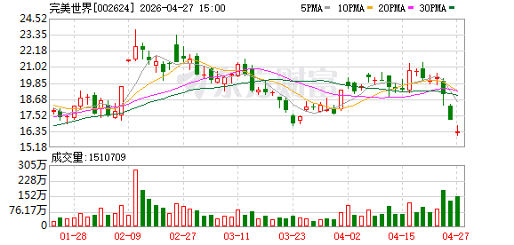
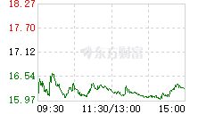
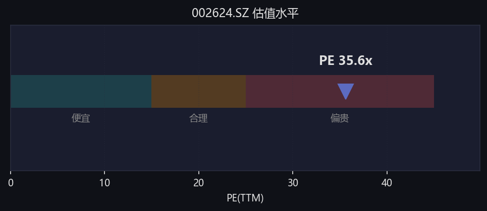

# 完美世界（002624.SZ）股票分析报告
**分析时间**：2026年4月27日

## 一、核心数据摘要
| 指标 | 数值 |
|------|------|
| 当前股价 | 16.28元 |
| 当日涨跌幅 | -4.91% |
| 总市值 | ~315.8亿元 |
| PE(TTM) | 35.59倍 |
| 市净率 | 4.46倍 |
| 52周最高价 | 16.73元 |
| 52周最低价 | 16.02元 |
| 今日主力资金流向 | 净流出6679.76万元 |

## 二、技术面分析
### 日K线走势

从日K线图可以看出：
1. **趋势**：当前处于明显的下跌通道，4月以来股价从20元上方持续回落，近期加速下跌，今日收盘价16.28元，接近52周最低点16.02元。
2. **均线**：5日、10日、20日、30日均线全部向下发散，且均位于股价上方，呈现典型的空头排列，短期压力较大。
3. **成交量**：近期下跌过程中成交量明显放大，说明抛压较重，市场恐慌情绪有所释放。
4. **支撑位**：当前股价接近52周低点16.02元，该位置是短期重要支撑位，若跌破可能进一步下探。

### 分时走势

今日分时走势：
- 早盘低开后快速下探，随后维持低位震荡，最低触及15.97元，尾盘略有回升，最终收于16.28元。
- 全天走势较弱，反映市场短期情绪偏空。

## 三、估值分析

当前PE(TTM)为35.59倍，处于历史估值的**偏贵区间**（30-40倍区间），相较于游戏行业平均20-30倍的PE水平，估值偏高，需要业绩增长来消化。

## 四、资金流向分析
- 今日主力资金净流出6679.76万元，散户资金净流入1.12亿元，呈现**主力出逃、散户接盘**的特征，短期资金面偏空。
- 北向资金今日无明显流向数据。

## 五、多空逻辑对比
| 🟢 做多逻辑 | 🔴 做空逻辑 |
|-----------|-----------|
| 1. 股价已接近52周低点，短期存在超跌反弹需求 | 1. 技术面完全走坏，空头排列明显，下跌趋势尚未扭转 |
| 2. 作为国内游戏行业头部公司，长期IP储备丰富，新品周期有望推动业绩增长 | 2. 当前估值35.6倍，高于行业平均水平，估值偏高 |
| 3. 游戏行业政策边际改善，版号发放常态化 | 3. 今日主力资金大幅流出，短期抛压较重 |
| | 4. 近期市场整体情绪偏弱，板块整体回调压力较大 |

## 六、操作建议
### 总评级：🟡 观望
**理由**：短期下跌趋势明确，估值偏高，资金面偏空，但股价已接近52周低点，不建议盲目杀跌，也不建议急于抄底，等待趋势明朗。

#### 分角色建议：
1. **已持仓者**：若仓位较重，可趁反弹适当降低仓位；若仓位较轻，可继续持有观察16元支撑位的有效性。
2. **观望者**：暂时保持观望，等待股价企稳（如连续2-3个交易日不再创新低、成交量萎缩、站上5日均线）后再考虑是否介入。
3. **短线激进者**：可在16元附近轻仓博弈超跌反弹，止损位设在15.8元，反弹压力位看17-17.5元。

## 七、风险提示
1. 游戏新品上线不及预期风险
2. 行业政策监管风险
3. 市场整体系统性下跌风险
4. 估值回归风险